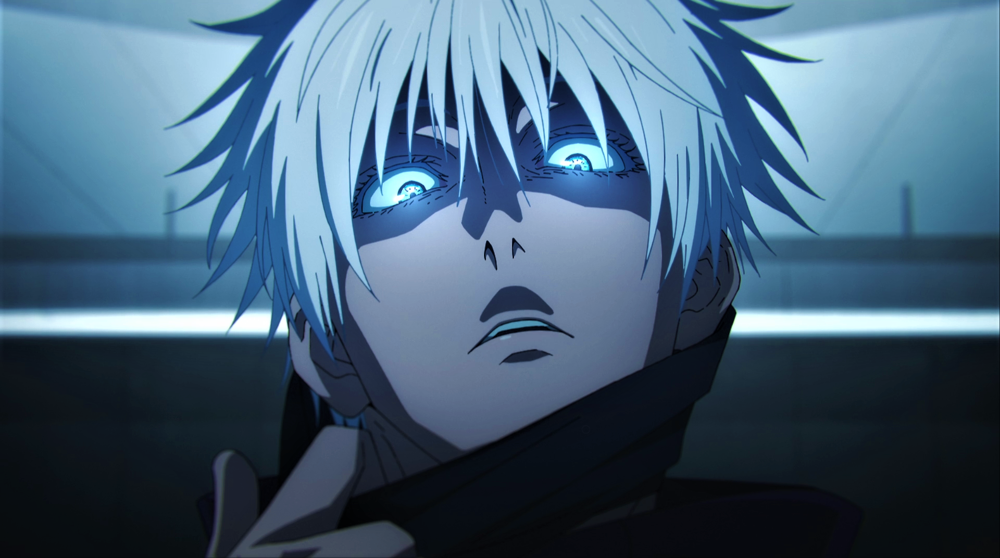

<!-- Header with animated shark -->

  

<!-- Animated welcome message -->

  

<!-- Fancy Social Links -->

  
  
  

<!-- GitHub Stats with Ocean Theme -->

<h3 align="center">
  黎策数据 | LC Stats 
</h3>

  
  

  

<!-- Profile Image with Glow Effect -->

  

<!-- Achievements -->

<h3 align="center">
  &nbsp;黎策成就 | LC mob Achievements
</h3>

  

<!-- Tech Stack with LC Animation -->

<h3 align="center">
  
  技术之黎 | Tech LC
</h3>

  
  
  
  
  
  
  
  

<!-- Interests with LC Theme -->

<h3 align="center">
  
  黎策兴趣 | LC Interests
</h3>

  
  
  

<!-- Snake Animation -->

<picture>
  <source media="(prefers-color-scheme: dark)" srcset="https://raw.githubusercontent.com/platane/platane/output/github-contribution-grid-snake-dark.svg">
  <source media="(prefers-color-scheme: light)" srcset="https://raw.githubusercontent.com/platane/platane/output/github-contribution-grid-snake.svg">
  
</picture>
<!-- Wave Footer -->

